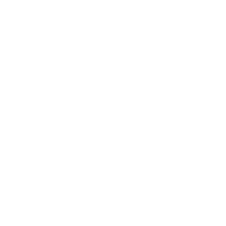

<div align="center">



# DoIt

**A polished, offline-first Todo desktop app built with Electron, React, and TypeScript.**

[](https://www.electronjs.org/)
[](https://react.dev/)
[](https://www.typescriptlang.org/)
[](https://vitejs.dev/)
[](https://tailwindcss.com/)
[](LICENSE)

</div>

---

## ✨ Features

| Feature | Details |
|---|---|
| 📝 **Task Management** | Create, edit, complete, and delete tasks effortlessly |
| 🏷️ **Priority Levels** | Tag each task as **Low**, **Medium**, or **High** priority |
| 📅 **Due Dates** | Optionally set deadlines for time-sensitive tasks |
| 🔍 **Search & Filter** | Instantly search by name or filter by All / Pending / Completed |
| 🌗 **Dark & Light Mode** | System-aware theme with one-click toggle, persisted across sessions |
| 💾 **Offline-First Storage** | All data stored locally via `electron-store` — no account, no cloud required |
| ⚡ **Blazing Fast** | Vite-powered dev builds and optimised production bundles |
| 📦 **Cross-Platform Builds** | Ships as an NSIS installer (Windows), DMG (macOS), or AppImage (Linux) |

---

## 🖥️ Tech Stack

| Layer | Technology |
|---|---|
| **Shell** | [Electron 35](https://www.electronjs.org/) |
| **UI** | [React 18](https://react.dev/) + [TypeScript 5](https://www.typescriptlang.org/) |
| **Bundler** | [Vite 6](https://vitejs.dev/) + `vite-plugin-electron` |
| **Styling** | [Tailwind CSS 3](https://tailwindcss.com/) with custom design tokens |
| **State** | [Zustand](https://zustand-demo.pmnd.rs/) |
| **Persistence** | [electron-store](https://github.com/sindresorhus/electron-store) (local JSON, sandboxed) |
| **Icons** | [LineIcons](https://lineicons.com/) |

---

## 🏗️ Project Structure

```
DoIt/
├── src/
│   ├── main/               # Electron main process
│   ├── preload/            # Context-bridge (secure IPC surface)
│   └── renderer/           # React app
│       ├── features/
│       │   └── tasks/      # Task store (Zustand), types, API helpers
│       ├── pages/          # Page-level components (Home)
│       └── shared/         # Reusable icons & UI primitives
├── public/                 # Static assets (app icon)
└── scripts/                # Build helpers
```

---

## 🚀 Getting Started

### Prerequisites

- [Node.js](https://nodejs.org/) 18 or later
- npm 9 or later

### Development

```bash
# 1. Clone the repo
git clone https://github.com/your-username/doit.git
cd doit

# 2. Install dependencies
npm install

# 3. Start dev server + Electron together
npm run electron:dev
```

> Vite spins up on `http://localhost:5173` and Electron loads it automatically.

### Available Scripts

| Command | Description |
|---|---|
| `npm run dev` | Start the Vite dev server only |
| `npm run electron:dev` | Start Vite **and** Electron concurrently |
| `npm run build` | Compile TypeScript and bundle with Vite |

---

## 🔐 Security

DoIt follows Electron security best practices:

- **Context Isolation** enabled — renderer has no direct Node.js access.
- **`contextBridge`** exposes only a typed `taskAPI` surface to the renderer.
- **`nodeIntegration`** is `false` in all renderer windows.
- No external network requests — all data stays on-device.

---

## 🤝 Contributing

Contributions, issues, and feature requests are welcome!

1. Fork the repository
2. Create a feature branch: `git checkout -b feat/my-feature`
3. Commit your changes: `git commit -m 'feat: add my feature'`
4. Push to the branch: `git push origin feat/my-feature`
5. Open a Pull Request

---

## 📄 License

Distributed under the **MIT License**. See [`LICENSE`](LICENSE) for details.

---

<div align="center">
  Made with 💟 by <a href="https://github.com/your-username">Prashant A.</a>
</div>
